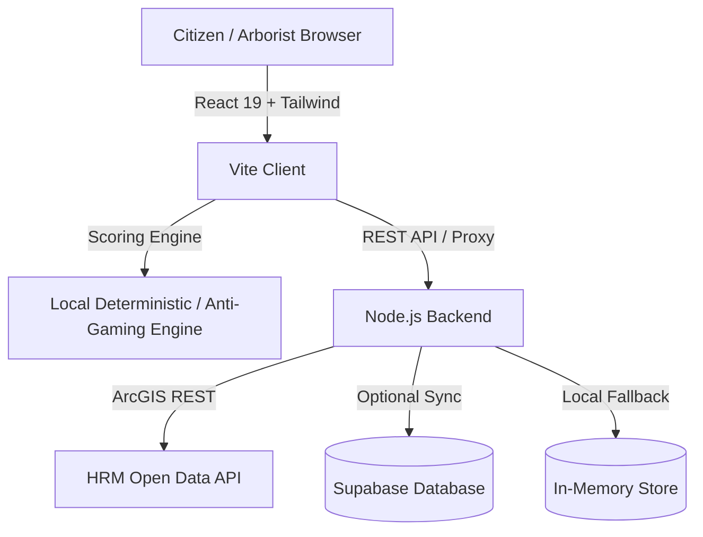

# 🌳 hackathon-claude-devang: Tree Hazard Detection ("Which Tree Falls First")

[](https://github.com/Ketankhunti/Tree-Hazard-Detection/actions/workflows/ci.yml)


An intelligent triage and hazard prioritization platform designed for **Halifax Urban Forestry** to evaluate, rank, and inspect pending urban tree complaints across the Halifax Regional Municipality (HRM).

The system addresses the critical question: **"Which tree falls first?"** by combining citizen complaint narratives, field photo evidence, arterial road impact weights, and wait times into an explainable, audit-ready priority score.

---

## 🌟 Key Features

- **Explainable Prioritization Engine**:
  - Deterministic 0–100 risk scoring with transparent factor breakdown:
    - **Combined Danger Score (50%)**: Structural defects (leaning, splitting, hollow trunk, dead branches, power line proximity).
    - **Wait Time Score (25%)**: Prioritizes aged complaints based on a 180-day baseline.
    - **Location Impact (15%)**: Weighting for high-density arterial corridors (e.g., Barrington St, Spring Garden Rd, Quinpool Rd, Robie St).
    - **Human Review Score (10%)**: Triage flagging for vague reports or low-confidence submissions.
  - Complaints categorized into priority tiers: `Critical`, `High`, `Medium`, and `Low`.

- **Anti-Gaming & Photo Verification**:
  - Citizens occasionally use exaggerated language (`"EMERGENCY"`, `"immediately"`) to jump the queue.
  - The system implements photo-first weighting (**65% visual evidence vs. 35% text claims**).
  - Automatically flags **Text-Image Conflicts** and downgrades scores when alarming descriptions contradict benign photos.

- **Real HRM Open Data Integration**:
  - Proxies live data from the Halifax Regional Municipality ArcGIS Open Data Portal:
    - **HRM Public Trees**: 80,000+ public tree assets with DBH, species, and utility wire flags.
    - **HRM 311 Call Details**: Historical tree-related inquiry records and resolutions.

- **Citizen Submission Portal**:
  - Enables residents to lodge reports with geolocation, address lookup, and field photo attachments.

- **Field Hazard Assessment Poster**:
  - One-click generation of printable, field-ready hazard summary posters for city arborists.

- **Zero-Friction Offline / Local Operation**:
  - Zero required external API keys or cloud databases to run locally.
  - Automatically falls back to an in-memory database and rich Halifax mock datasets if the backend or Supabase is offline.

---

## 🏗️ Architecture & Tech Stack



- **Frontend**: React 19, TypeScript, Vite, Tailwind CSS v4, Lucide React, React Router.
- **Backend**: Lightweight Node.js server (zero external runtime dependencies).
- **Persistence**: Hybrid Supabase PostgreSQL persistence with instant in-memory fallback.
- **Testing & Quality**: Vitest unit testing suite, Oxlint static analysis, and TypeScript strict mode.

---

## 🚀 Getting Started

### Prerequisites
- **Node.js**: `v20.x` or `v22.x`
- **npm**: `v10.x` or higher

### Installation

1. **Clone the repository**:
   ```bash
   git clone https://github.com/Ketankhunti/Tree-Hazard-Detection.git
   cd Tree-Hazard-Detection
   ```

2. **Install frontend dependencies**:
   ```bash
   npm install
   ```

3. **Install backend dependencies**:
   ```bash
   cd backend
   npm install
   cd ..
   ```

---

## ⚙️ Environment Configuration

Copy the example environment files to configure your environment:

```bash
cp .env.example .env
cp backend/.env.example backend/.env
```

| Variable | Scope | Description | Default / Required |
|---|---|---|---|
| `VITE_API_BASE` | Frontend | Backend API base URL | `http://localhost:3001/api` |
| `VITE_GOOGLE_MAPS_API_KEY` | Frontend | Google Maps / Geocoding API key | Optional |
| `GEMINI_API_KEY` | Root / Backend | Google Gemini API key for AI vision | Optional |
| `PORT` | Backend | HTTP Port for backend service | `3001` |
| `SUPABASE_URL` | Backend / Root | Supabase project URL | Optional (falls back to in-memory) |
| `SUPABASE_PUBLISHABLE_KEY` | Backend / Root | Supabase anonymous public API key | Optional (falls back to in-memory) |

> [!NOTE]
> All external services (Supabase, Google Maps, Gemini) are **completely optional**. The entire application runs out-of-the-box locally with mock data and in-memory persistence.

---

## 💻 Running the Application

### 1. Start the Backend Service
```bash
npm run dev:backend
```
The backend will launch on `http://localhost:3001`:
- Health Check: `http://localhost:3001/api/health`
- Complaints API: `http://localhost:3001/api/complaints`
- Tree Inventory: `http://localhost:3001/api/trees`
- 311 Calls: `http://localhost:3001/api/311-calls`

### 2. Start the Frontend Application
In a separate terminal:
```bash
npm run dev
```
Open `http://localhost:5173` in your browser.

---

## 🧪 Testing & Code Quality

Run automated unit tests, type-checking, and linting:

```bash
# Run unit test suite (Vitest)
npm test

# Run TypeScript type-checking
npm run typecheck

# Run static analysis (Oxlint)
npm run lint

# Build production bundle
npm run build
```

---

## 🛡️ Anti-Gaming & AI Prompt Contract

The scoring engine enforces strict anti-gaming heuristics that mirror the future LLM system prompt defined in [`src/lib/systemPrompt.ts`](file:///d:/projects/Tree%20hazard%20detection/Tree-Hazard-Detection/src/lib/systemPrompt.ts):
- Visual confirmation of leaning angles, cracked trunks, or wire interference overrides subjective citizen descriptions.
- Keyword stuffing or emotional exaggeration (e.g., `"someone could die"`) without visual backing is penalized or flagged for mandatory human arborist inspection.

---

## 🤝 Contributing

Contributions are welcome! Please follow these steps:
1. Create a branch for your feature or fix:
   ```bash
   git checkout -b contributions/your-feature-name
   ```
2. Ensure all tests, lint checks, and typechecks pass:
   ```bash
   npm run typecheck
   npm run lint
   npm test
   npm run build
   ```
3. Commit your changes with clear semantic messages (`feat:`, `fix:`, `docs:`, `test:`).
4. Open a Pull Request against `main`.

---

## 📄 License

This project was built for the Halifax Urban Forestry hackathon initiative. Open source under the MIT License.
